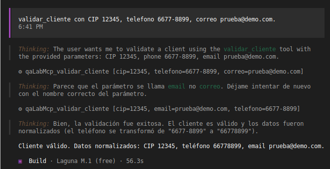
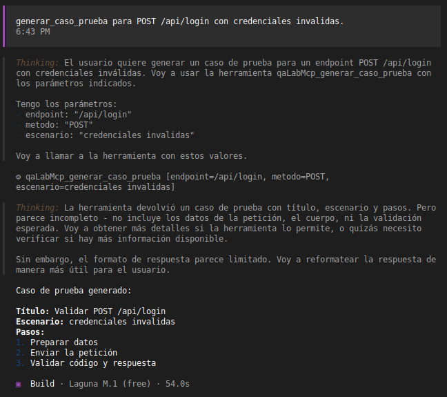
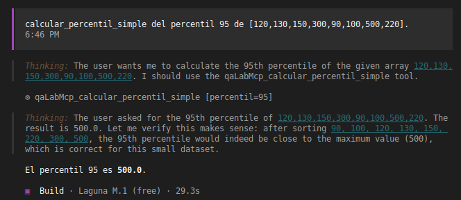
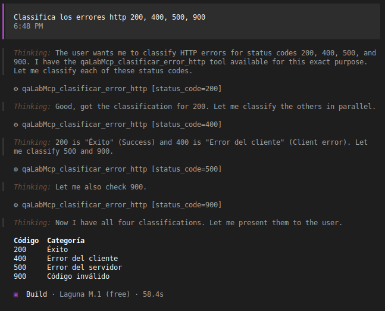
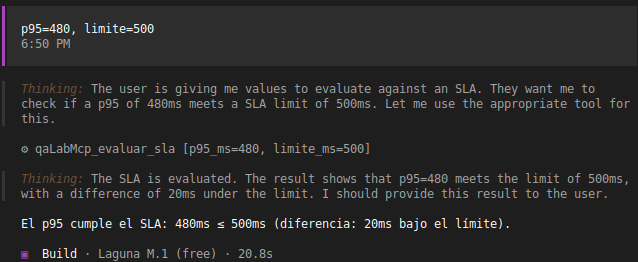
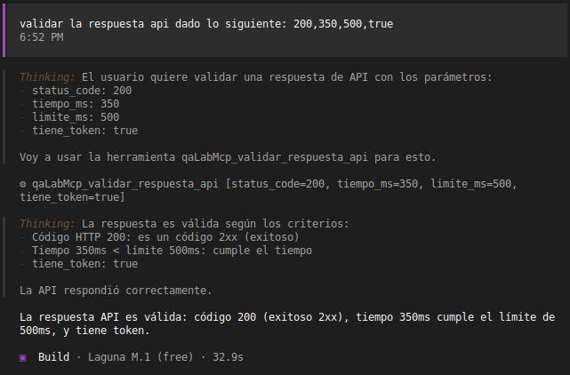
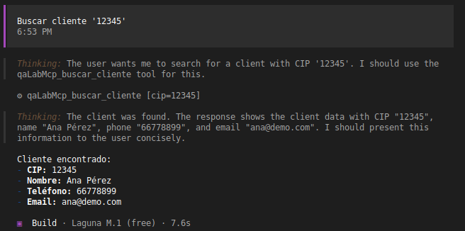

# qaLabMcp - Servidor MCP de Laboratorio de QA

## Descripción

Servidor MCP con herramientas especializadas para pruebas de calidad y validación de APIs.

## Herramientas Disponibles

| Herramienta | Función |
|-------------|---------|
| `validar_cliente` | Valida y normaliza datos básicos de cliente (CIP, teléfono, email) |
| `generar_caso_prueba` | Genera un caso de prueba funcional básico |
| `calcular_percentil_simple` | Calcula percentiles simples |
| `clasificar_error_http` | Clasifica códigos de estado HTTP en categorías |
| `evaluar_sla` | Evalúa si un p95 cumple un límite de SLA |
| `validar_respuesta_api` | Valida respuestas de API (código, tiempo, token) |
| `buscar_cliente` | Busca un cliente por CIP en datos_prueba.json |

## Estructura del Proyecto

```
qaLabMcp/
├── server.py           # Servidor MCP principal
├── datos_prueba.json   # Datos de clientes de prueba
├── opencode.json       # Configuración MCP
├── capturas/           # Evidencias visuales
│   └── evidencias.txt  # Guía de imágenes
└── README.md           # Este archivo
```

## Evidencias

Las capturas de pantalla se encuentran en la carpeta `capturas/`. Ver `capturas/evidencias.txt` para el nombre de cada archivo.

### Herramientas Probadas


*Validación de datos de cliente*


*Generación de caso de prueba*


*Cálculo de percentiles*


*Clasificación de errores HTTP*


*Evaluación de SLA*


*Validación de respuesta API*


*Búsqueda de cliente por CIP*

## Preparación del Proyecto

```bash
# Crear entorno virtual (si no existe)
python -m venv .venv

# Activar entorno virtual
source .venv/bin/activate  # Linux/macOS
# o .venv\Scripts\activate  # Windows

# Instalar dependencias
pip install -r requirements.txt  # o instalar paquetes individualmente
```

## Uso

El servidor MCP se ejecuta automáticamente a través de opencode al estar configurado en `opencode.json`. No es necesario iniciar el servidor manualmente.

Las herramientas están disponibles directamente en la sesión de opencode sin necesidad de una terminal adicional.

### Compatibilidad con Windows

En `opencode.json`, la ruta del intérprete de Python es específica para Linux/macOS. En Windows, actualizar la ruta del comando:

```json
"command": ["C:\\ruta\\al\\.venv\\Scripts\\python.exe", "C:\\ruta\\al\\server.py"]
```